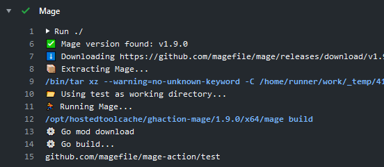

<p align="center">
  
  <h3 align="center">Mage Action</h3>
  <p align="center"><a href="https://github.com/features/actions">GitHub Action</a> for Mage</p>
  <p align="center">
    <a href="https://github.com/magefile/mage-action/releases/latest"></a>
    <a href="https://github.com/marketplace/actions/mage-action"></a>
    <a href="https://github.com/magefile/mage-action/actions?workflow=test"></a>
    <a href="https://codecov.io/gh/magefile/mage-action"></a>
    <a href="https://github.com/sponsors/crazy-max"></a>
  </p>
</p>

___



* [Usage](#usage)
* [Customizing](#customizing)
  * [inputs](#inputs)
* [Using on GHES](#using-on-ghes)
* [License](#license)

## Usage

```yaml
name: mage

on:
  pull_request:
  push:

jobs:
  mage:
    runs-on: ubuntu-latest
    steps:
      -
        name: Checkout
        uses: actions/checkout@v3
      -
        name: Set up Go
        uses: actions/setup-go@v3
        with:
          go-version: 1.14
      -
        name: Run Mage
        uses: magefile/mage-action@v2
        with:
          version: latest
          args: build
```

> For detailed instructions please follow GitHub Actions [workflow syntax](https://help.github.com/en/articles/workflow-syntax-for-github-actions#About-yaml-syntax-for-workflows).

## Customizing

### inputs

Following inputs can be used as `step.with` keys

| Name      | Type   | Default  | Description                               |
|-----------|--------|----------|-------------------------------------------|
| `version` | String | `latest` | Mage version. Example: `v1.9.0`           |
| `args`    | String |          | Arguments to pass to Mage                 |
| `workdir` | String | `.`      | Working directory (below repository root) |

## Using on GHES

If you specify a version or `latest` of GoReleaser in your workflow, the
version will be downloaded from [GitHub Releases in `magefile/mage`](https://github.com/magefile/mage/releases)
repository. These calls to `magefile/mage` are made via unauthenticated
requests, which are limited to [60 requests per hour per IP](https://docs.github.com/en/rest/overview/resources-in-the-rest-api#rate-limiting).

If more requests are made within the time frame, then you will start to see
rate-limit errors during downloading that looks like:

```
##[error]API rate limit exceeded for...
```

To get a higher rate limit, you can [generate a personal access token on github.com](https://github.com/settings/tokens/new)
and pass it as the `github_token` input for the action:

```yaml
uses: magefile/mage-action@v2
with:
  github_token: ${{ secrets.GH_DOTCOM_TOKEN }}
  version: v1.14.0
```

If the runner is not able to access `github.com`, it will take the default one
available on the GitHub Runner or runner's tool cache. See "[Setting up the
tool cache on self-hosted runners without internet
access](https://docs.github.com/en/enterprise-server@3.2/admin/github-actions/managing-access-to-actions-from-githubcom/setting-up-the-tool-cache-on-self-hosted-runners-without-internet-access)"
for more information.

## License

MIT. See `LICENSE` for more details.
